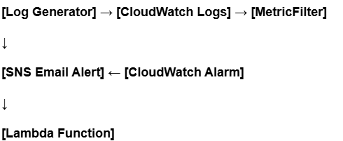
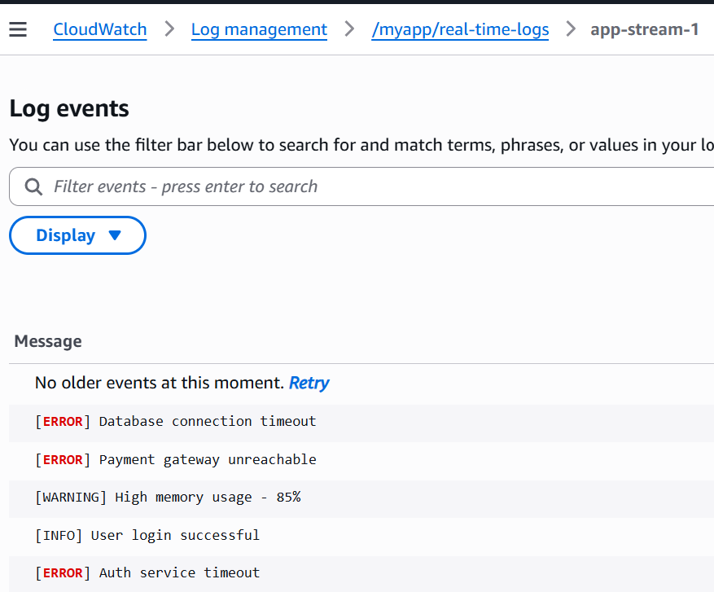
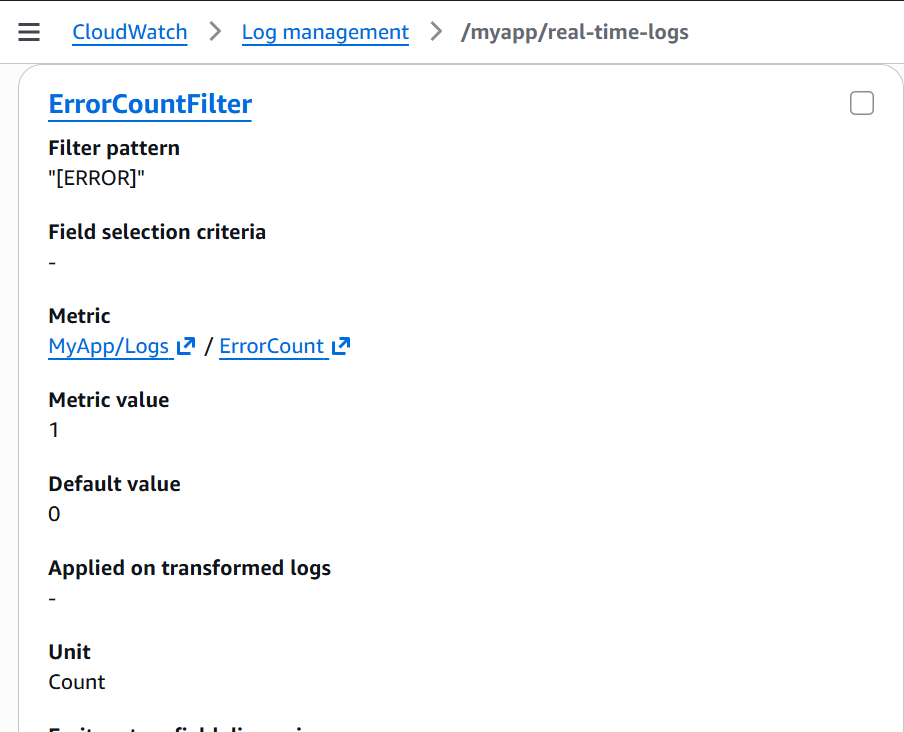
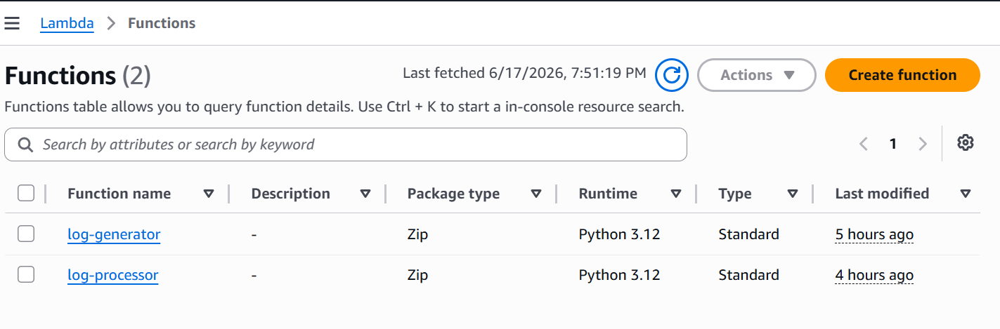
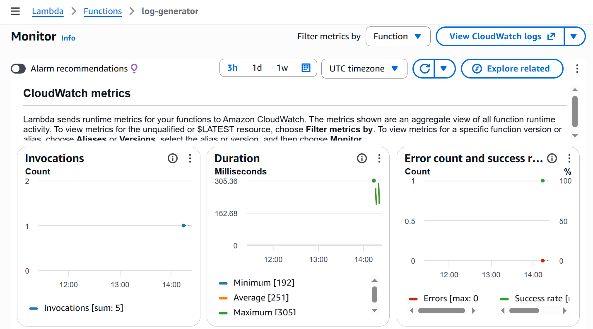
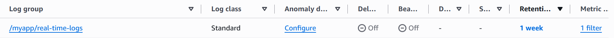

# 🔍 Real-Time Log Monitoring & Alerting System on AWS

> A cloud-native, serverless log monitoring system that automatically
> detects application errors in real-time and delivers instant email
> alerts — built entirely using AWS managed services.

## 📌 Project Overview

In modern cloud applications, monitoring logs manually is impossible.
This project solves that by building an automated pipeline that watches
application logs 24/7, detects errors instantly, and alerts the team
without any human intervention.

This project was built using the AWS Management Console demonstrating
real-world cloud monitoring skills.

## 🏗️ Architecture

## ⚙️ AWS Services Used

| Service | Purpose |
|---|---|
| AWS Lambda | Generates and processes application logs |
| Amazon CloudWatch Logs | Collects and stores all application logs |
| CloudWatch Metric Filters | Scans logs and detects ERROR patterns |
| CloudWatch Alarms | Triggers alert when error count exceeds threshold |
| Amazon SNS | Delivers real-time email notifications |
| AWS IAM | Manages secure permissions between services |

## 🔄 How It Works

1. Log Generator Lambda pushes application logs to CloudWatch
2. Logs contain three levels — ERROR WARNING INFO
3. Metric Filter scans every incoming log for ERROR pattern
4. When 2 or more errors appear within 60 seconds — alarm triggers
5. CloudWatch Alarm changes state to IN ALARM
6. Amazon SNS delivers instant email alert with full error details
7. When errors stop — alarm returns to OK state automatically

## 📸 Project Screenshots

### CloudWatch Log Stream

### CloudWatch Metric Filter

### CloudWatch Alarm Triggered

### Email Alert Received

### Lambda Functions

### Lambda Monitor

### CloudWatch Log Group

## 🚀 Key Features

- Real-time error detection within 60 seconds
- Automated email alerts with zero manual monitoring
- Serverless architecture — no servers to manage
- Auto recovery detection when system returns to normal
- Built entirely on AWS Free Tier

## 💡 What I Learned

- Designed a serverless event-driven architecture on AWS
- Implemented real-time observability using CloudWatch
- Built an automated alerting pipeline with zero manual intervention
- Understood how production systems are monitored in real companies
- Applied IAM least-privilege security model between AWS services

## 🔧 Future Improvements

- Add CloudWatch Dashboard for visual log analytics
- Integrate PagerDuty for on-call team alerting
- Add log anomaly detection using CloudWatch Insights
- Build Terraform version for infrastructure as code
- Add Slack notification alongside email alerts

## 📄 License

This project is open source and available under the MIT License.
